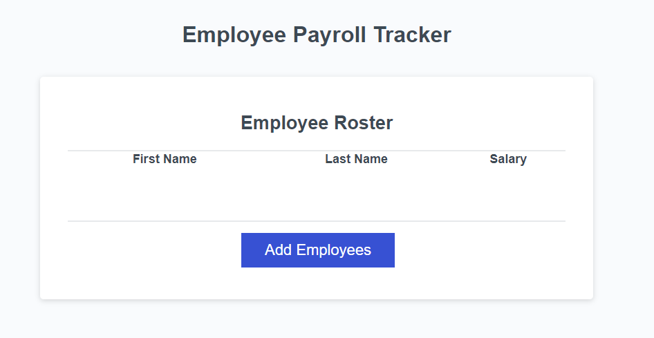
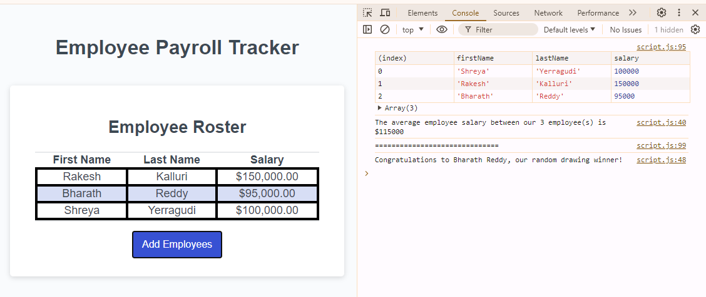

# Employee payroll tracker

## Description

An employee payroll tracker to view and manage employee payroll data.

## Installation

N/A

## Usage

This employee payroll tracker helps the payroll manager to see the employee payroll data and properly budget for the company.

## Screenshots

The following screenshots shows the web application's appearance

## Codebase

You can find the project repository [here](https://github.com/shreyareddy6/employee-payroll-tracker.git)

You can find the deployed page [here](https://shreyareddy6.github.io/employee-payroll-tracker/)

## Credits

N/A

## License

Please refer to the LICENSE in the repo.
